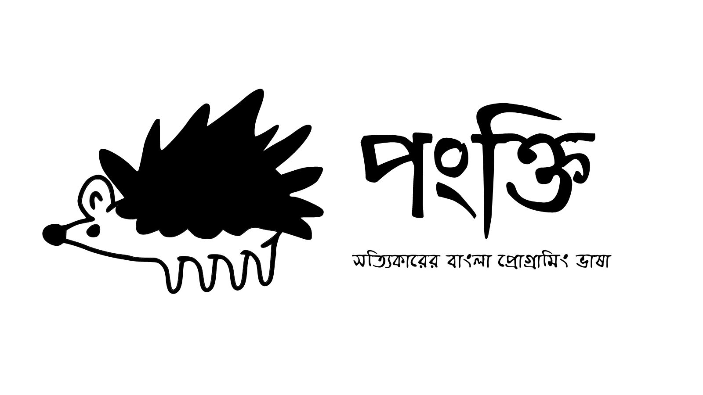

## Introduction
Pankti is an interpreted dynamically typed programming language for The Bengali language. It is fast, easy to learn and available on Windows, Linux and Android. You can program in Bengali as well as English with Pankti. You can write a program in a single platform (OS) and run it on any platform (OS) where Pankti is available.

## Why
My mother tongue is Bengali. Previously there have been few attempts to build a Bengali programming language but most of them have no practical usage, so I ventured into the dark world of language design. Pankti was designed from ground up without using parsing generators so it has most of the raw power of go programming language. 

## Language Features

###  Data Types:
* Strings : `"পলাশ বাউরি"` , `"ভাবনা"`...
* Numbers:
    - Integers : `99999` , `1234567890` , `১২৩৪৫৬৭৮৯০`
    - Floats : `1.23` , `২০.০২`
* Dictionaries/Hashmaps : `{ "নাম": "পলাশ", "বয়স" : 20  }`
* Arrays: `["রবিবার", "সোমবার" , 21 , 22 , ৯৯]`
* Booleans: `সত্য`, `মিথ্যা`

